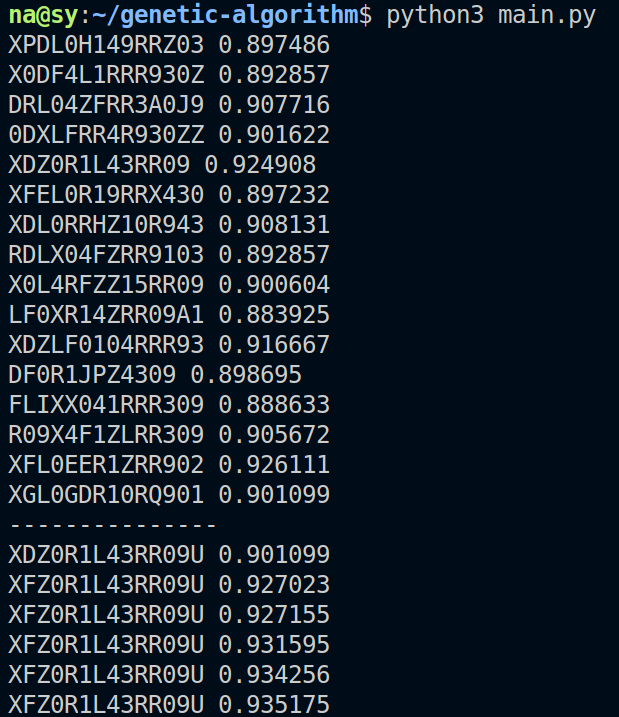

Étudiants : Emna Barred & Nabil Lamrabet.

Encadrants : Simon Forest & Rémy Chaput.

Intelligence Bio-Inspirée, Master IA, Université Lyon 1, année 2020-2021.

#  TP Algorithmes génétiques

## Codage du génotype

Le génotype est une suite de caractères [A-Z] [0-9].

La proximité des caractères est la suivante :

Pour les lettres, la proximité est l'ordre alphabétique, A et B ont une proximité de 1.

Pour les chiffres, la proximité est l'ordre numérique, 0 et 1 ont une proximité de 1.

La lettre Z a une proximité de 1 avec le chiffre 0, le chiffre 9 a une proximité de 1 avec la lettre A.

On peut représenter la proximité de cette façon :

```
A-B-C-D-E-F-G-H-I-K-L-M-N-OP-Q-R-S-T-U-V-W-X-Y-Z-0-1-2-3-4-5-6-7-8-9
```

Avec 9 qui boucle sur A, ou :

```
0-1-2-3-4-5-6-7-8-9-A-B-C-D-E-F-G-H-I-K-L-M-N-OP-Q-R-S-T--U-V-W-X-Y-Z
```

Avec Z qui boucle sur 0.

## Sélection

### Fitness

On sélectionne deux individus avec la "roulette-wheel" sélection.

La part d'un individu dans la roulette est proportionnelle à sa fitness.

Ici, la fitness est calculée avec la proximité de l'individu par rapport au mot de passe de l'utilisateur.


### Sélection par rang

Nous avons implémenté une sélection par rang linéaire et exponentielle. Nous avons également modifié la sélection par rang exponentielle afin que la sélection soit uniforme (universal stochastic sampling).

## Mutation

On parcourt chaque gène d'un individu, le gène a une probabilité de muter (la probabiltié est passée en paramètre).

Une fois le génotype parcouru, on a une probabilité de supprimer un gène au hasard ou une probabilité d'ajouter un gène au hasard (ces types de mutations s'appliquent uniquement si nous avons 13 à 17 gènes inclus).

## Crossover

On ajoute avec une probabilité un crossover des deux individus sélectionnés.

On peut échanger un certain nombre fixe de gènes, ces gènes sont choisis au hasard (exemple on échange les gènes de rang 4, 5, 8, 9, 10).

On peut échanger les gènes à partir d'un certain rang fixé (exemple : on échange tous les gènes de rang supérieur à 5).

## Premier algorithme

On récupère deux individus grâce à la roulette-wheel sélection.

On ajoute deux individus issus du crossover des parents précédents, avec une certaine probabilité. On ajoute également à la nouvelle population une version mutée des parents précédents.

On réitère ces manipulations jusqu'à avoir une population de même taille.

On ajoute ensuite les deux individus de la population précédente ayant les meilleurs fitness ou alors les parents issues de la roulette-wheel sélection (si on veut ou non mettre de l'élitisme).

# Amélioraitons de l'algorithme et hyper-paramètres

Nous avons modifié notre algorithme d'origine. Notre nouvel algorithme se compose en deux parties. Dans un premier temps la diversité est le point central, après que la diversité a bien été exploitée, on travail sur les meilleurs individus.

Dans un premier temps, l'objectif est de déceler rapidement les populations qui ont du potentielles de celles qui n'en n'ont pas.
On va donc générer aléatoirement une population et lui donner un petit nombre de générations (80 générations). Si cette population n'atteint pas un certain seuil d'intérêt elle est abandonnée (mais si le seuil est atteint elle est conservée pour la suite) et on recommence en générant une nouvelle population aléatoirement. 

Nous considérons qu'une population dont le meilleur individu ayant un score inférieur à 85% doit être abandonnée.

On réitère les étapes précédentes jusqu'à avoir 10 à 20 populations intéressantes.

Derrière cette méthode, il y a l'intuition que les meilleurs individus de ces différentes populations sont très proches de la solution mais de façons différentes (elles ne le sont pas pour les même raisons, elles ont donc chacune un point fort à exploiter, l'objectif désormais est d'utiliser les crossover en espérant avoir le meilleur de chaque population).
On pense qu'à ce stade, la solution est une combinaison de l'ensemble de ces individus.
On décide donc de sélectionner les meilleurs individus de chaque population afin d'effectuer des crossover entre eux (mais on n'oublie pas également d'effectuer de très minimes mutations, en effet il se peut qu'un élément échappe à toutes  nos populations).



Nous avons essayé de nuancer les mutations (nous créons différents individus qui mutent de façon plus ou moins importantes) lors de la première étape.

Lors de la deuxième étape nous essayons de nuancer les crossovers (de la même façon, nous créons à chaque génération des individus qui sont le résultat de crossovers plus ou moins importants).

Nous avons également essayé d'introduire de l'élitisme néanmoins cette pratique a tendance à limiter la diversité et n'apporte finalement pas beaucoup d'amélioration.

On obtient à la première étape nos meilleurs individus se trouvent entre 85% et 88% de la solution. À la seconde étape on obtient des individus entre 90% et 93%.

À ce point nous arrivons à un plateau, nous ne sommes pas arrivés à aller au-delà de 96%.

